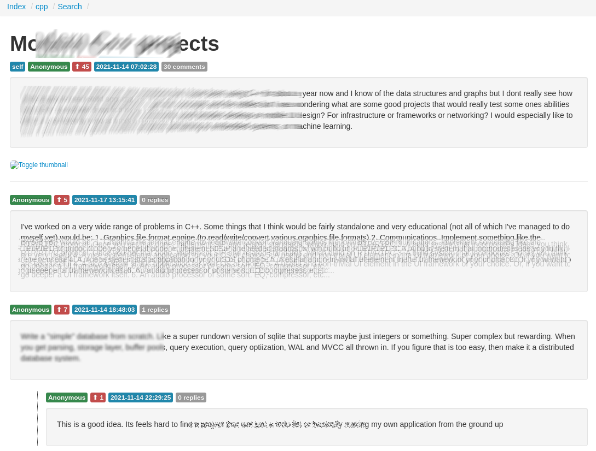

# redarc
A self-hosted solution to search, view and create your own Reddit archives.

## Features:
- Ingest pushshift dumps
- View threads/comments
- Elasticsearch support
- Submit threads to be archived via API (Completely untested.  Developed with mock data and the [PRAW](https://praw.readthedocs.io/en/stable/) documentation)

Please abide by the Reddit Terms of Service and [User Agreement](https://www.redditinc.com/policies/user-agreement-april-18-2023) if you are using their API




### Download pushshift dumps

```
https://the-eye.eu/redarcs/
```
All data 2005-06 to 2022-12:
```
magnet:?xt=urn:btih:7c0645c94321311bb05bd879ddee4d0eba08aaee&tr=https%3A%2F%2Facademictorrents.com%2Fannounce.php&tr=udp%3A%2F%2Ftracker.coppersurfer.tk%3A6969&tr=udp%3A%2F%2Ftracker.opentrackr.org%3A1337%2Fannounce
```
Top 20,000 subreddits:
```
magnet:?xt=urn:btih:c398a571976c78d346c325bd75c47b82edf6124e&tr=https%3A%2F%2Facademictorrents.com%2Fannounce.php&tr=udp%3A%2F%2Ftracker.coppersurfer.tk%3A6969&tr=udp%3A%2F%2Ftracker.opentrackr.org%3A1337%2Fannounce
```
# Installation:

Master branch is unstable. Please checkout a release

## Docker 

Install Docker: https://docs.docker.com/engine/install

If you wish to change the postgres password, make sure `POSTGRES_PASSWORD` and `PGPASSWORD` are the same.

If you are using redarc on your personal machine, set docker envars `REDARC_API=http://localhost/api` and `SERVER_NAME=localhost`.

`REDARC_API` is the URL of your API server; it must end with `/api` 
eg: `http://redarc.mysite.org/api`.  

`REDARC_SUBMIT` is the URL of your submission service; it must end with `/ingest` 
eg: `http://redarc.mysite.org/ingest`.  

`SERVER_NAME` is the URL your redarc instance is running on. eg: `redarc.mysite.org`

Setting an `INGEST_PASSWORD` in redarc_ingest is highly recommended to prevent abuse.

## Docker compose (Recommended):

Docker compose:

Modify envars as needed
```
$ git clone https://github.com/Yakabuff/redarc.git
$ cd redarc
$ git fetch --all --tags
$ git checkout tags/v0.2.0 -b v0.2.0
// Modify docker-compose.yml as-needed
$ docker compose up -d
```

## Manual installation:

```
$ git clone https://github.com/Yakabuff/redarc.git
$ cd redarc
```
### 1) Provision Postgres database 

```
$ docker pull postgres
$ docker run \
  --name pgsql-dev \
  -e POSTGRES_PASSWORD=test1234 \
  -d \
  -v ${PWD}/postgres-docker:/var/lib/postgresql/data \
  -p 5432:5432 postgres 
```

```
$ docker run \
  --name pgsql-fts \
  -e POSTGRES_PASSWORD=test1234 \
  -d \
  -v ${PWD}/postgres-docker:/var/lib/postgresql/data \
  -p 5433:5432 postgres 
```

```
psql -h localhost -U postgres -a -f scripts/db_submissions.sql
psql -h localhost -U postgres -a -f scripts/db_comments.sql
psql -h localhost -U postgres -a -f scripts/db_subreddits.sql
psql -h localhost -U postgres -a -f scripts/db_submissions_index.sql
psql -h localhost -U postgres -a -f scripts/db_comments_index.sql
psql -h localhost -U postgres -a -f scripts/db_status_comments.sql
psql -h localhost -U postgres -a -f scripts/db_status_comments_index.sql
psql -h localhost -U postgres -a -f scripts/db_status_submissions.sql
psql -h localhost -U postgres -a -f scripts/db_status_submissions_index.sql
psql -h localhost -U postgres -p 5433 -a -f scripts/db_fts.sql
psql -h localhost -U postgres -a -f scripts/db_progress.sql
```

### 2) Process dump and insert rows into postgres database with the load_sub/load_comments scripts

```
python3 scripts/load_sub.py <path_to_submission_file>
python3 scripts/load_comments.py <path_to_comment_file>
python3 scripts/load_sub_fts.py <path_to_submission_file>
python3 scripts/load_comments_fts.py <path_to_comment_file>
python3 scripts/index.py [subreddit_name]
python3 scripts/unlist.py <subreddit> <true|false>
```

### 3) Start the API server.

```
$ cd api
$ python -m venv venv
$ source venv/bin/activate
$ pip install gunicorn
$ pip install falcon
$ pip install rq
$ pip install python-dotenv
$ pip install psycopg2-binary
$ gunicorn app
```

### 4) Start the frontend

```
cd ../redarc-frontend
mv sample.env .env
```
Set address for API server in the .env file

```
VITE_API_DOMAIN=http://my-api-server.com/api/
VITE_SUBMIT_DOMAIN=http://my-submit-server.com/ingest/
```

```
npm i
npm run dev // Dev server
```

### 5) Provision NGINX (Optional)

Edit nginx/nginx_original.conf with your own values
```
$ cd ..
$ mv nginx/redarc_original.conf /etc/nginx/conf.d/redarc.conf
```

```
cd redarc-frontend
npm run build 
cp -R dist/* /var/www/html/redarc/
systemctl restart nginx
```

### 6) Setup submission workers

Fill in .env files with your own credentials.

Setting an `INGEST_PASSWORD` is highly recommended in order to prevent abuse.

```
$ cd redarc/redarc_ingest
$ python -m venv venv
$ source venv/bin/activate
$ pip install rq
$ pip install python-dotenv
$ pip install praw
$ pip install psycopg2-binary
$ python3 -m worker.reddit_worker &
$ python3 -m worker.index_worker &
```

# Ingest data:

## Postgres:

Ensure `python3`, `pip` and `psycopg2-binary` are installed:
```
# Decompress dumps

$ unzstd <submission_file>.zst

$ unzstd <comment_file>.zst

$ pip install pyscopg2-binary

# Change database credentials if needed

$ python3 scripts/load_sub.py <path_to_submission_file>

$ python3 scripts/load_sub_fts.py <path_to_submission_file>

$ python3 scripts/load_comments.py <path_to_comment_file>

$ python3 scripts/load_comments_fts.py <path_to_comment_file>

$ python3 scripts/index.py [subreddit_name]

# Optional
python3 scripts/unlist.py <subreddit> <true|false>
```

## Web:

- Submit Reddit URL using the web form `/submit`

# API:

`search/comments?`
- `[unflatten = <True/False>]`
- `[subreddit = <name>]`
- `[id = <id>]`
- `[before = <utc_timestamp>]`
- `[after = <utc_timestamp>]`
- `[parent_id = <parent_id>]`
- `[link_id = <link_id>]`
- `[sort = <ASC/DESC>]`

`search/submissions?`
- `[subreddit = <name>]`
- `[id = <id>]`
- `[before = <utc_timestamp>]`
- `[after = <utc_timestamp>]`
- `[sort = <ASC|DESC>]`

`search/subreddits`

`search?`
- `<subreddit = <subreddit>>`
- `[before = <unix timestamp>]`
- `[after = <unix timestamp>]`
- `[sort = <asc|desc>]`
- `[query = <seach phrase>]`
- `<type = <comment|submission>>`

# License:

Redarc is licensed under the MIT license